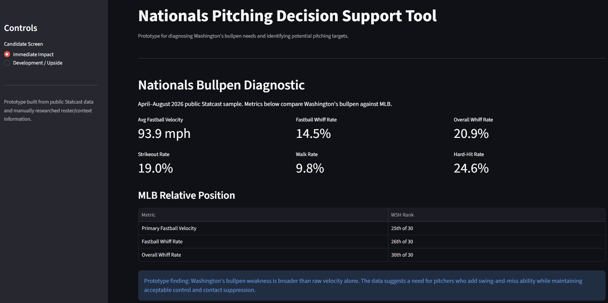
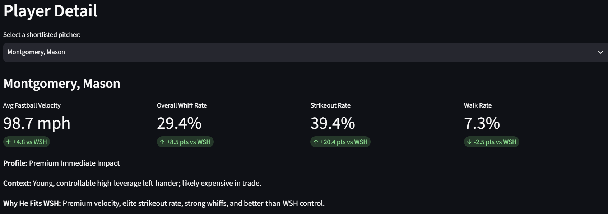

# Nationals Pitching Decision Support Tool

A lightweight baseball analytics prototype designed to diagnose Washington's bullpen weaknesses and identify pitchers whose profiles could address those needs.

**Live App:** https://nationals-pitching-tool.streamlit.app/

## Overview

The project began with a simple hypothesis:

> Did the Washington Nationals need more bullpen velocity?

Using public MLB Statcast data, I analyzed approximately 588,000 pitches from April through August 2026 and compared Washington's bullpen against MLB.

The analysis showed that velocity was only part of the issue. Washington also ranked near the bottom of MLB in fastball whiff rate and last in overall whiff rate.

This shifted the product question from:

> Who throws hard?

to:

> Which pitchers could improve Washington's velocity and/or swing-and-miss profile while maintaining acceptable control and contact suppression?

## Key Findings

- WSH primary fastball velocity: **93.9 mph — 25th of 30**
- WSH fastball whiff rate: **14.5% — 26th of 30**
- WSH overall whiff rate: **20.9% — 30th of 30**
- WSH strikeout rate: **19.0%**
- WSH walk rate: **9.8%**

## Screenshots

### Bullpen Diagnostic

### Player Detail

## Product Workflow

1. Diagnose the bullpen need
2. Compare Washington against MLB benchmarks
3. Screen pitchers by profile
4. Separate immediate-impact from development/upside candidates
5. Add roster, contract, transaction, and availability context
6. Produce a research shortlist
7. Compare shortlisted pitchers directly against the WSH baseline

## MVP Features

- Nationals Bullpen Diagnostic
- Immediate Impact candidate screen
- Development / Upside candidate screen
- Final shortlist
- Player-detail comparison
- Indexed WSH vs. pitcher visualization
- Methodology and data notes

## Technology

- Python
- pandas
- pybaseball
- MLB Statcast
- Altair
- Streamlit
- Google Colab
- Google Sheets

## Design Decisions

### Diagnose before screening
The initial velocity hypothesis was refined after analysis showed Washington's larger issue was swing-and-miss performance.

### Transparent screening
The MVP uses explainable thresholds rather than an arbitrary composite score.

### Separate performance from context
Pitch performance is associated with unique pitcher IDs, while current organization and roster context are maintained separately because those attributes can change independently.

## Limitations

This prototype:

- uses only public data
- uses simplified reliever classification
- does not estimate trade value
- does not predict future performance
- does not perform medical or injury-risk modeling
- does not replace professional scouting or player-development evaluation
- does not recommend specific transactions

## Purpose

This project was built as a baseball operations decision-support prototype demonstrating:

- product thinking
- baseball analytics
- data analysis
- screening methodology
- contextual research
- interactive tool development
